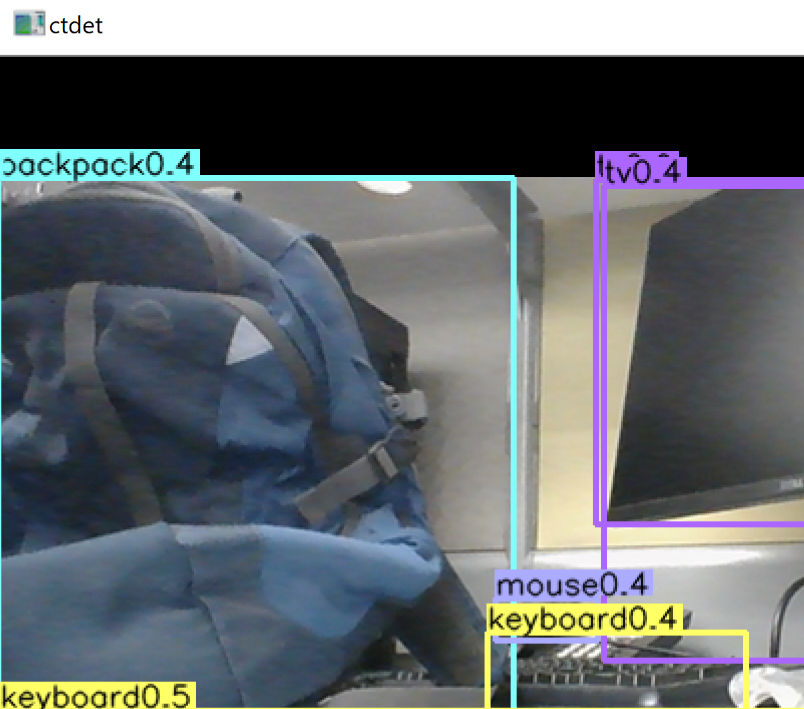

# Windows build for CenterNet based object detection
 with CUDA10, Python 3.6.8
# Steps
Create separate virtual env, with Python 3.6
- conda install pytorch torchvision cudatoolkit=10.0 -c pytorch
- Clone updated CEnternet for Windows10 from,
https://github.com/prabindh/CenterNet
Note: COCO API not needed for typical detection problems
- install pip requirements from repo
- This repo already has updated <>CenterNet\Lib\site-packages\torch\nn\functional.py
Changed torch.backends.cudnn.enabled to False
- cd CenterNet\src\lib\models\networks, delete DCNv2 folder and clone https://github.com/prabindh/DCNv2
- from src/DCNv2, perform "python setup.py build develop"
Should have below log after this.

`Installed <>\centernet\src\lib\models\networks\dcnv2`
`Processing dependencies for DCNv2==0.1`
`Finished processing dependencies for DCNv2==0.1`
- nms appears mandatory, getting below error without it - 
`(CenterNet) <>\CenterNet\src>python demo.py ctdet --demo /path/to/image/or/folder/or/video --load_model ../models/ctdet_coco_dla_2x.pth`
`Traceback (most recent call last):`
 ` File "demo.py", line 11, in <module>`
`ModuleNotFoundError: No module named 'external.nms'`
- Adding nms using 
`(CenterNet) <>\CenterNet\src\lib\external>python setup.py build_ext --inplace`
had to remove the additional options "extra_compile_args" from setup.py to avoid errors. This should result in below log.
`   Creating library build\temp.win-amd64-3.6\Release\nms.cp36-win_amd64.lib and object build\temp.win-amd64-3.6\Release\nms.cp36-win_amd64.exp`
`Generating code`
`Finished generating code`
- Download this model: "http://dl.yf.io/dla/models\imagenet\dla34-ba72cf86.pth" to CenterNet\models\dla34-ba72cf86.pth

## References
https://github.com/xingyizhou/CenterNet/issues/7

#Results

`Perform below, for demonstration with webcam,`
`CenterNet\src>python demo.py ctdet --demo webcam --load_model ../models/ctdet_coco_dla_2x.pth`
`Fix size testing.`
`training chunk_sizes: [32]`
`The output will be saved to  CenterNet\src\lib\..\..\exp\ctdet\default`
`heads {'hm': 80, 'wh': 2, 'reg': 2}`
`Creating model...`
`loaded ../models/ctdet_coco_dla_2x.pth, epoch 230`
`tot 0.301s |load 0.000s |pre 0.086s |net 0.194s |dec 0.011s |post 0.009s |merge 0.002s |`
`tot 0.307s |load 0.000s |pre 0.084s |net 0.192s |dec 0.015s |post 0.014s |merge 0.003s |`
`tot 0.309s |load 0.000s |pre 0.086s |net 0.198s |dec 0.012s |post 0.012s |merge 0.001s |`
`tot 0.295s |load 0.000s |pre 0.079s |net 0.187s |dec 0.016s |post 0.012s |merge 0.002s |`
`tot 0.296s |load 0.001s |pre 0.080s |net 0.194s |dec 0.012s |post 0.009s |merge 0.002s |`
`tot 0.294s |load 0.000s |pre 0.077s |net 0.196s |dec 0.011s |post 0.009s |merge 0.002s |`

This should run webcam demo if a camera is connected.

